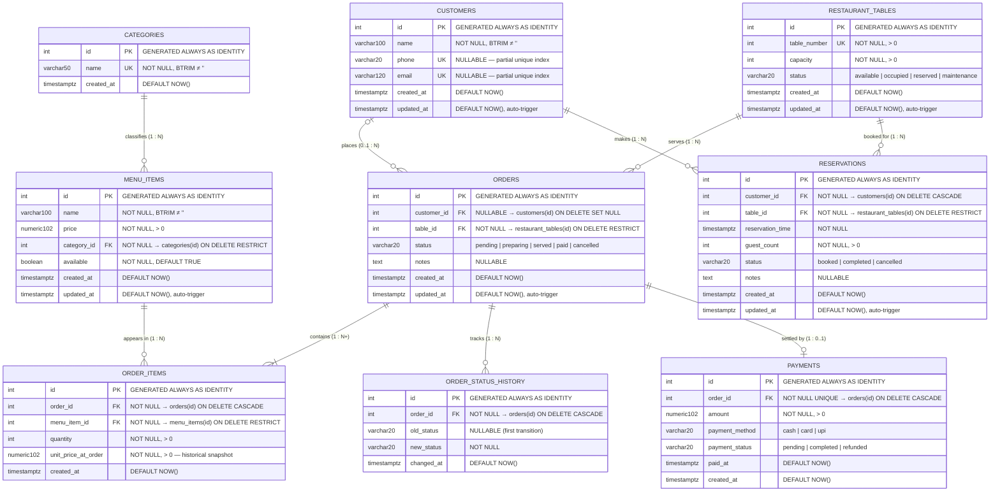
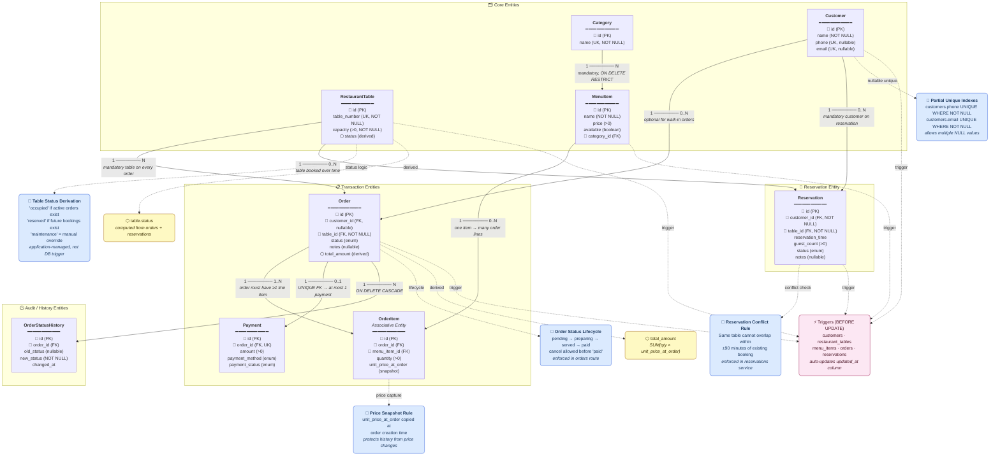
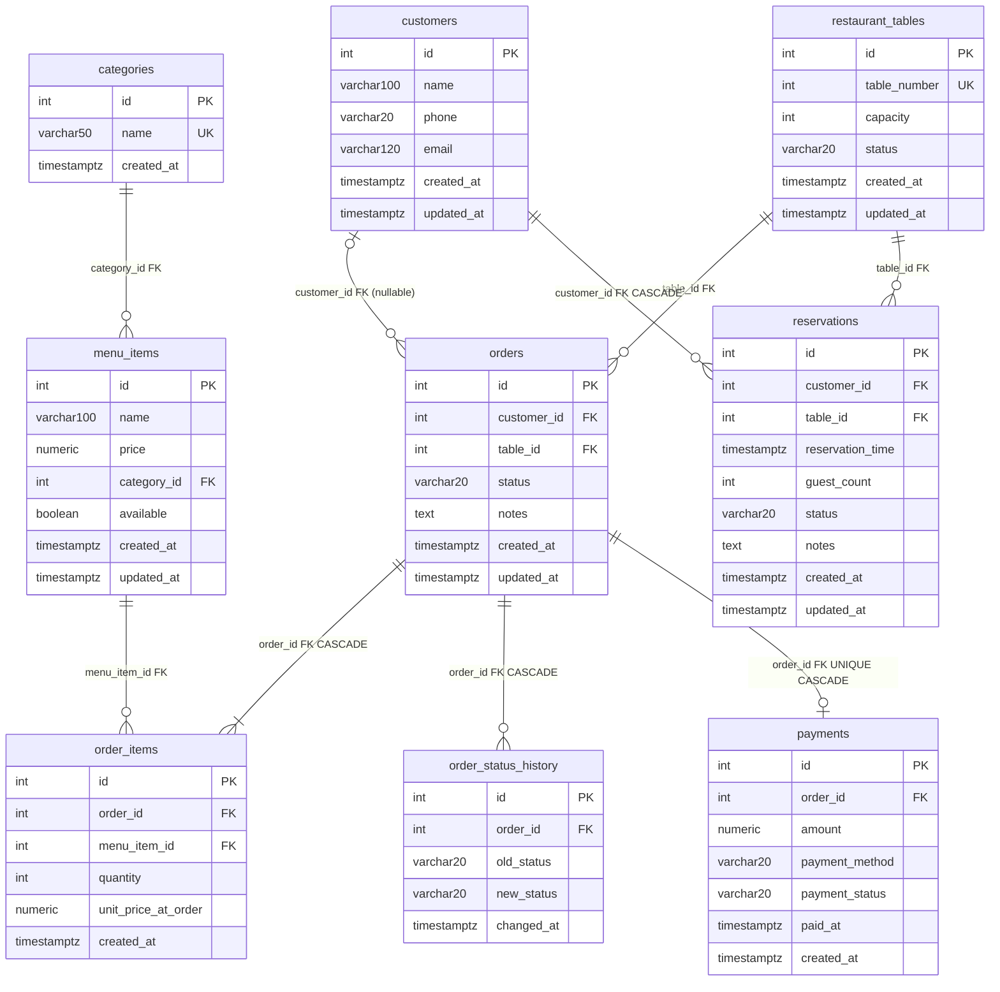

# Restaurant App — ER, EER & Relational Diagrams

> **Source**: `backend/setup.sql` + business rules enforced in `backend/routes/` and `backend/services/`
>
> **Database**: PostgreSQL (schema `restaurant_app`) with in-memory fallback (`pg-mem`)

---

## 1 · Entity-Relationship (ER) Diagram

Crow's-foot notation. Every entity shows all attributes with keys and nullability.

---

## 2 · Enhanced Entity-Relationship (EER) Diagram

The EER diagram adds:
- **Derived / computed attributes** (dashed)
- **Business-rule constraints** (blue boxes)
- **Specialisation / participation constraints**
- **Aggregation** (order_items as associative entity)
- **Temporal / audit** semantics

---

## 3 · Relational Schema Diagram

Shows all tables with columns, primary keys (🔑), foreign keys (🔗), unique keys (UK), and indexes.

---

## 4 · Cardinality & Participation Summary

| Relationship | ER Notation | Participation | Enforcement |
|---|---|---|---|
| `categories` → `menu_items` | 1 : N | Total on MenuItem side | `NOT NULL FK`, `ON DELETE RESTRICT` |
| `customers` → `orders` | 1 : N (optional) | Partial on Order side | `NULLABLE FK`, `ON DELETE SET NULL` |
| `restaurant_tables` → `orders` | 1 : N | Total on Order side | `NOT NULL FK`, `ON DELETE RESTRICT` |
| `orders` → `order_items` | 1 : N (min 1) | Total — app enforces ≥1 | `ON DELETE CASCADE`, app-level check |
| `menu_items` → `order_items` | 1 : N | Partial | `NOT NULL FK`, `ON DELETE RESTRICT` |
| `orders` → `payments` | 1 : 0..1 | Optional | `UNIQUE FK`, `ON DELETE CASCADE` |
| `orders` → `order_status_history` | 1 : N | Partial | `ON DELETE CASCADE` |
| `customers` → `reservations` | 1 : N | Total on Reservation side | `NOT NULL FK`, `ON DELETE CASCADE` |
| `restaurant_tables` → `reservations` | 1 : N | Partial | `NOT NULL FK`, `ON DELETE RESTRICT` |

---

## 5 · Index Reference

| Index Name | Table | Column(s) | Type | Purpose |
|---|---|---|---|---|
| `idx_menu_items_category_id` | `menu_items` | `category_id` | B-Tree | Fast menu lookups by category |
| `idx_menu_items_available` | `menu_items` | `available` | B-Tree | Filter available items |
| `idx_customers_phone_unique` | `customers` | `phone WHERE NOT NULL` | Partial Unique | Unique non-null phones |
| `idx_customers_email_unique` | `customers` | `email WHERE NOT NULL` | Partial Unique | Unique non-null emails |
| `idx_orders_status` | `orders` | `status` | B-Tree | Filter active/pending orders |
| `idx_orders_created_at` | `orders` | `created_at DESC` | B-Tree | Recent orders pagination |
| `idx_orders_table_id` | `orders` | `table_id` | B-Tree | Orders per table lookup |
| `idx_order_items_order_id` | `order_items` | `order_id` | B-Tree | Line items for an order |
| `idx_order_items_menu_item_id` | `order_items` | `menu_item_id` | B-Tree | Sales per menu item |
| `idx_payments_paid_at` | `payments` | `paid_at DESC` | B-Tree | Revenue reports by time |
| `idx_payments_method` | `payments` | `payment_method` | B-Tree | Payment method analytics |
| `idx_reservations_table_time` | `reservations` | `(table_id, reservation_time)` | B-Tree | Conflict detection query |
| `idx_reservations_status_time` | `reservations` | `(status, reservation_time)` | B-Tree | Active/future booking filter |

---

## 6 · EER Specialisation & Additional Constraints

### 6.1 Attribute Constraints (CHECK)

| Table | Column | Constraint |
|---|---|---|
| `categories` | `name` | `BTRIM(name) <> ''` |
| `customers` | `name` | `BTRIM(name) <> ''` |
| `restaurant_tables` | `table_number` | `> 0` |
| `restaurant_tables` | `capacity` | `> 0` |
| `restaurant_tables` | `status` | `IN ('available', 'occupied', 'reserved', 'maintenance')` |
| `menu_items` | `name` | `BTRIM(name) <> ''` |
| `menu_items` | `price` | `> 0` |
| `orders` | `status` | `IN ('pending', 'preparing', 'served', 'paid', 'cancelled')` |
| `order_items` | `quantity` | `> 0` |
| `order_items` | `unit_price_at_order` | `> 0` |
| `order_status_history` | `old_status` | `NULL OR IN (status enum values)` |
| `order_status_history` | `new_status` | `IN (status enum values)` |
| `payments` | `amount` | `> 0` |
| `payments` | `payment_method` | `IN ('cash', 'card', 'upi')` |
| `payments` | `payment_status` | `IN ('pending', 'completed', 'refunded')` |
| `reservations` | `guest_count` | `> 0` |
| `reservations` | `status` | `IN ('booked', 'completed', 'cancelled')` |

### 6.2 Composite Unique Constraints

| Table | Columns | Meaning |
|---|---|---|
| `menu_items` | `(name, category_id)` | Same dish name allowed in different categories |
| `order_items` | `(order_id, menu_item_id)` | One line per item per order (quantity field aggregates) |
| `payments` | `order_id` | One payment record per order (1:0..1 via UNIQUE FK) |

### 6.3 Application-Level Business Rules (Not in SQL)

| Rule | Where Enforced |
|---|---|
| Order status can only advance forward (`pending→preparing→served→paid`) | `backend/routes/orders.js` |
| Cancellation only allowed before `paid` | `backend/routes/orders.js` |
| `restaurant_tables.status` computed from active orders & bookings | App logic on every order/reservation change |
| Reservation conflict: same table cannot overlap within ±90 minutes | `backend/services/reservationService.js` |
| Order must contain ≥1 item before it can be placed | `backend/routes/orders.js` |

---

## 7 · Entity Descriptions

| Entity | Role | Walk-in Support |
|---|---|---|
| **categories** | Groups menu items (Starters, Mains, Desserts, Beverages) | — |
| **customers** | Registered customers; optional on orders (walk-ins) | ✅ via nullable FK |
| **restaurant_tables** | Physical dining tables with capacity & status | — |
| **menu_items** | Dishes/drinks with price and availability flag | — |
| **orders** | Core transaction linking a table (and optionally a customer) to items | ✅ customer optional |
| **order_items** | Associative entity (M:N resolution) storing quantity + price snapshot | — |
| **order_status_history** | Temporal audit log for every order status transition | — |
| **payments** | Final payment record; at most one per order | — |
| **reservations** | Future table booking; always requires a registered customer | ❌ customer mandatory |
